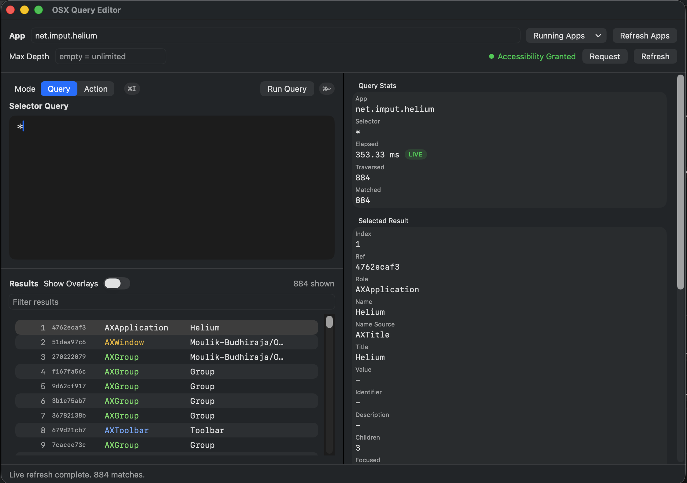

# OSX Query Editor

OSX Query Editor is a native macOS app for running OSXQuery selector queries against live app accessibility trees and inspecting results in real time.

## Features

- Target apps by bundle identifier, app name, PID, or `focused`
- Run OXQ selector queries with live stats
- Inspect matched element metadata and hierarchy details
- Filter results locally
- Run actions on selected elements:
  - `click`
  - `press`
  - `focus`
  - `set-value`
  - `set-value-submit`
  - `send-keystrokes-submit`

## Screenshot



## Download Binary

Download the latest macOS binary from the GitHub Releases page:

[v0.1.0 Release](https://github.com/Moulik-Budhiraja/OSX-Query-Editor/releases/tag/v0.1.0)

## Build From Source (Alternative)

### Open In Xcode

```bash
open OSXQueryEditor.xcodeproj
```

### Build From CLI

```bash
xcodebuild -project OSXQueryEditor.xcodeproj -scheme OSXQueryEditor -configuration Debug build
```
